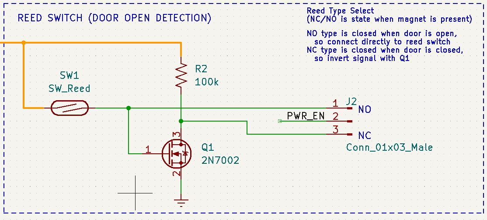
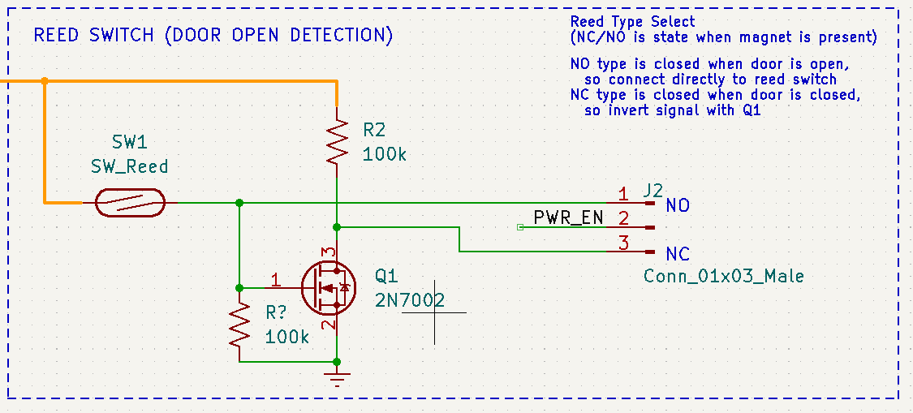
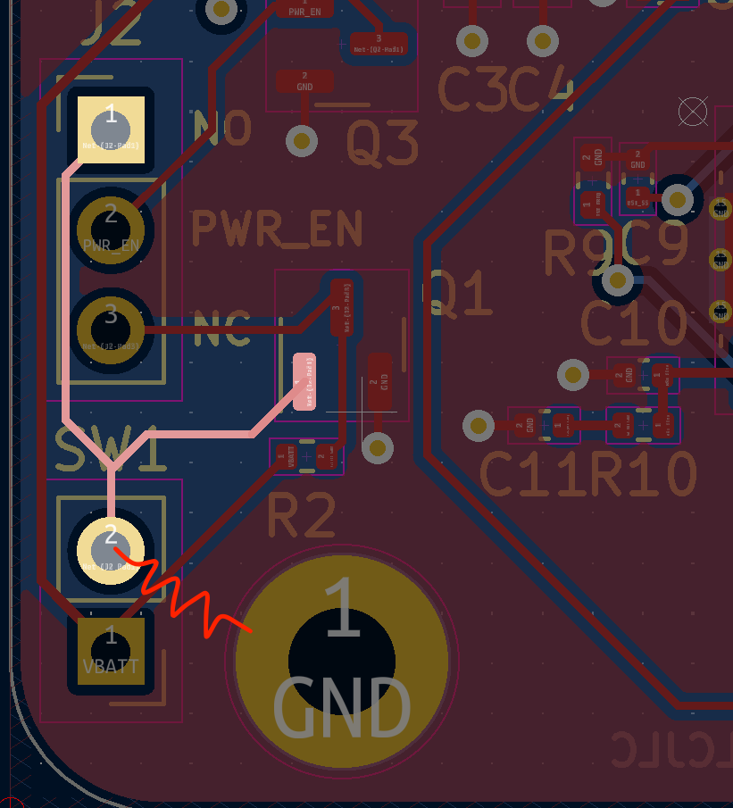

# PCB Rev0
The first attempat at a PCB to boost 4-AA batteries to driver 12V LED strip.

  

Here is the board next to a AA battery.

## Design
See the [schematic print](Outputs/BatteryLedStripDriver.pdf). Key elements include:  
#### Boost converter
*  `TPS55340PWP` to boost ~6V (with new batteries) to 12V. Needed something with a high enough current limit on the power switch to support 1A out at a duty cycle of 4V->12V, plus wanted it in stock at JLCPCB. This one matched those criteria and had the added benefit of TI's WEBENCH tool support.
#### PWM signal generator
* 555 timer `TLC555xD` for optional PWM dimming, with potentiometer to set duty cycle. Here's an [article with 555 timer circuits](https://www.electronics-tutorials.ws/waveforms/555-circuits-part-1.html) that I referred to while adding this to the schematic. 
#### PMOS pass transistors
* `DMP2305U` to switch the boost converter and 555 timer input power on door open/close. Using PMOS because I didn't want to get into charge pumps to drive NMOS transistors. This one is rated for max Vds of -20V, max drain current of -4A, and Rdson of 60mΩ when pulling Vgs to -4.5V. 
#### Reed switch
* Found a [reed switch with both NC and NO options](https://www.amazon.com/dp/B073Z7TQ5D), which meant I couldn't mess up the order and get the wrong type :)
* This will be used to detect the door open/close state
* I added a small circuit to deal with the reed switch as NO or NC, selected by a jumper. This NC/NO combined switch was great for testing that circuit. 
#### Other Notes
* Some sections are tied together with 0 ohm resistors in case anything didn't work it could be excluded by removing a resistor instead of removing the whole IC. 
* I wasn't sure how well PWM-ing the boost converter output would work since it would effectively be seen as continuous load transients. Normally you would want to tie the EN pin of the DC/DC with the PWM signal, but this boost converter has an EN falling delay of 1ms before disabling, but it was hard enough to find this one to use, so I just went for it. I figured the lights would dim but the output voltage might be a bit ugly on the oscilloscope.
* Followed [Phil's Lab video](https://www.youtube.com/watch?v=C7-8nUU6e3E) on how to take a Kicad project to JLCPCB for fabrication and assembly. Some of the process is slightly updated since the video was made but it was easy enough to use, in fact the JLC website has a great in-browser experience for adjusting the part rotations that wasn't available at the time the video was filmed. 

## Bring up notes
#### Missing Pulldown
* Found a missed pulldown resistor on the gate of Q1 while reviewing the schematic again before the board arrived
  * This proved to in fact be an issue where the reed switch would not induce a state change unless it was probed with the oscilloscope, presumably adding a small leakage path to ground.
      

  * Added 100k from Q1 gate (pin 1) to GND. I had a 100k through-hole on hand, so I tied it from SW1 pin 1 to the unmasked mounting hole, since the mounting holes were tied to GND (for easy oscillocope probe GND clip spots).   
        
    The net with the gate of Q1 is highlighted in the PCB image below, showing where the resistor was added between the SW1 jumper pin and GND pad of the mounting hole.

      

  * :white_check_mark: With the pulldown in place the board turns on/off with the reed switch as desired! :) 
* All of the following test notes assume the Q1 pulldown is in place.

#### Enable
* :white_check_mark: Tested NO and NC enable modes (with the appropriate NO or NC reed switch connection), both turn on the output when the reed swith is opened/separated (i.e. the door is opened), so the invert/no-invert circuit works as desired. 
#### PWM
* Tested with two 1k resistors in parallel to get 12V/500ohm = 24mA load
* Can PWM up to 100% duty cycle and down to less than 5%
* Output waveform is not nice and square, has a 2.5-3V dip on PWM rising edge, likely because of the load transient caused by PWM-ing the load without disabling the power converter. 

#### With LEDs
:white_check_mark: Testing with a short LED strip works great and LEDs can dim as expected by adjusting the potentiometer. 

#### End-to-End Test
* :white_check_mark: Battery bank + PCB + small LED tape + Reed switch, works as desired :)
    

* :white_check_mark: Full test with battery bank and 2 ft. LED strip works!   
* There is an audible buzzing/humming when dimming the LEDs while drawing high current (longer strip) due to PWM-ing the output, and most likely [causing the cermaic output capacitors to vibrate against the PCB](https://www.murata.com/en-us/products/capacitor/ceramiccapacitor/library/apps/notepc) in the audio frequency band due to the low PWM frequency. Going to 100% duty cycle eliminates the noise. 

## Installation
Here it is installed above the door inside the previous very dark closet.  
    
I have 1980's textured ceiling/walls inside the closet, so I stuck the LED strip to the thinnest peice of wood I had on hand, zip-tied the battery holder and PCB to another peice of wood, and attched each with some screws into the drywall. 
The reed switch and magnet are mounted at the top of the doorway and the door. 

